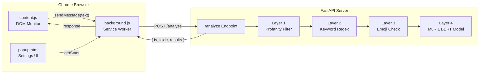
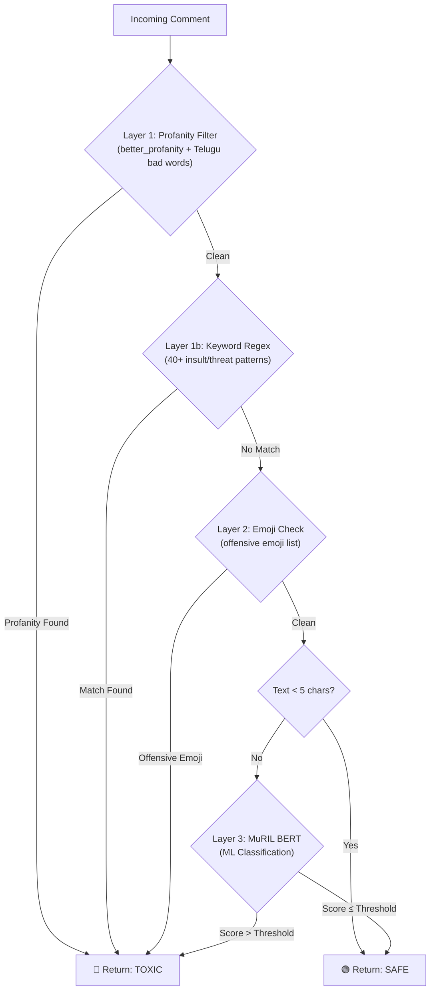

# System Architecture

## Overview

Comment Guard follows a **client-server** architecture. The Chrome extension acts as the client, and a FastAPI server acts as the backend. The backend runs a multi-layer detection pipeline to classify comments.

## Architecture Diagram

## Detection Pipeline — Detailed Flow

The backend processes each comment through **four layers** in sequence. If any layer flags the comment as toxic, it short-circuits and returns immediately without running the remaining layers.

## Why a Multi-Layer Approach?

| Layer | Strengths | Limitations |
|---|---|---|
| **Profanity Filter** | Instant, zero false negatives on known words | Cannot catch new or misspelled slurs |
| **Keyword Regex** | Catches compound insults (e.g., "waste fellow") | Cannot understand context or sarcasm |
| **Emoji Check** | Catches visual toxicity | Limited to known offensive emojis |
| **MuRIL BERT** | Understands context, tone, and novel insults | Requires GPU for fast inference; may miss rare slang |

The rule-based layers act as a **fast first line of defense**. The ML model handles the **nuanced, context-dependent cases** that rules cannot cover.

## End-to-End Request Flow

1. **User types** in any text input on any website
2. **`content.js`** detects the input via event listeners and a MutationObserver
3. After **800ms of inactivity** (debounce), the text is sent to `background.js`
4. **`background.js`** forwards it as `POST /analyze` to the FastAPI backend
5. **`main.py`** runs the 4-layer detection pipeline
6. The result (`is_toxic: true/false`) is returned to the extension
7. **`content.js`** applies visual feedback:
   - **Toxic** → orange-red text, tooltip warning, Send button disabled, Enter key blocked
   - **Safe** → all warnings cleared

## Strictness Modes

| Mode | Threshold | Use Case |
|---|---|---|
| **High** (Strict) | 0.4 | Celebrity pages, public forums — catches more borderline cases |
| **Low** (Balanced) | 0.7 | Friend chats, private groups — allows casual language |

The threshold applies only to the ML model layer. Rule-based layers always trigger regardless of the strictness setting.
