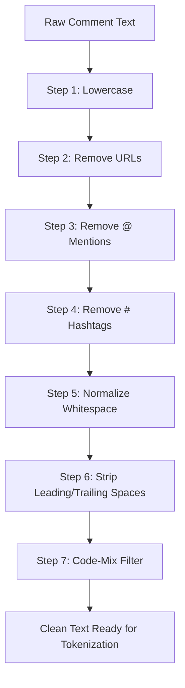

# Data Preprocessing

## Overview

Raw social media comments are noisy. They contain URLs, hashtags, mentions, inconsistent casing, and extra whitespace. The preprocessing pipeline cleans and normalizes the text before feeding it to the model.

## Preprocessing Steps



## Step-by-Step Details

### Step 1 — Lowercase Conversion
```
Input:  "Rey MENTAL Puku Fellow"
Output: "rey mental puku fellow"
```
Ensures consistent matching regardless of how the user typed the text.

### Step 2 — Remove URLs
```
Input:  "check this http://spam.com bad link"
Output: "check this  bad link"
```
URLs carry no sentiment information and add noise to the model.

### Step 3 — Remove Mentions
```
Input:  "@user123 you are trash"
Output: " you are trash"
```
Usernames are not relevant to toxicity classification.

### Step 4 — Remove Hashtags
```
Input:  "#trending bad comment"
Output: " bad comment"
```
Hashtags are metadata, not content.

### Step 5 — Normalize Whitespace
```
Input:  "rey   mental   fellow"
Output: "rey mental fellow"
```
Collapses multiple spaces into one.

### Step 6 — Strip Edges
```
Input:  "  hello  "
Output: "hello"
```
Removes leading and trailing whitespace.

### Step 7 — Code-Mix Filter
Keeps only **Telugu-English code-mixed** text:
- Must contain at least some **Latin (English) characters** (A–z)
- Rows that are purely Telugu script (>80% Telugu Unicode characters) are filtered out
- Empty strings are removed

```
"nuvvu waste fellow"  → ✅ Kept (has English characters)
"నువ్వు చెడ్డవాడివి"    → ❌ Filtered (pure Telugu script)
```

## Additional Cleaning (Training Data Only)

### Duplicate Removal
- Exact-match deduplication on the `text` column
- Prevents the model from memorizing repeated examples

### Label Normalization
Different datasets use different label names. These are all mapped to a **binary format**:

| Original Label | Mapped To |
|---|---|
| `hate`, `offensive`, `hof`, `toxic`, `1`, `yes` | **1** (Toxic) |
| `non-hate`, `not`, `none`, `0`, `no` | **0** (Safe) |

## Implementation Reference

The preprocessing logic is in these files:

| Function | File | Purpose |
|---|---|---|
| `clean_text()` | `kaggle_training_v3.py` | URL, mention, hashtag, whitespace cleaning |
| `is_code_mixed()` | `kaggle_training_v3.py`, `train_model.py` | Code-mix filtering |
| `load_data()` | `kaggle_training_v3.py`, `train_model.py` | Auto-detects columns and loads data |
