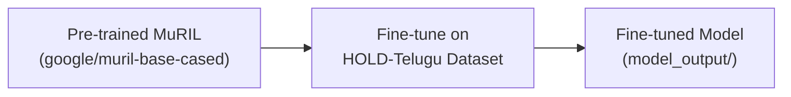

# MuRIL BERT Model

## What Is MuRIL?

**MuRIL** (Multilingual Representations for Indian Languages) is a Transformer-based language model developed by **Google Research India**. It is specifically designed to understand **Indian languages** — both in native scripts and transliterated (Romanized) forms.

## Why MuRIL for Comment Guard?

Comment Guard needs to understand **Telugu-English code-mixed text** like:

> "nuvvu waste fellow ra" (You're a waste fellow)  
> "super ga undi bro" (It's super, bro)

Standard English models (like `toxic-bert`) struggle with this because they were trained only on English text. MuRIL was trained on **17 Indian languages**, including Telugu, making it far better at understanding code-mixed content.

## Model Comparison

| Property | toxic-bert | MuRIL BERT |
|---|---|---|
| **Developer** | Unitary AI | Google Research India |
| **Base Architecture** | BERT-base | BERT-base |
| **Languages** | English only | 17 Indian languages + English |
| **Telugu Support** | ❌ No | ✅ Yes (native + transliterated) |
| **Code-Mixed Text** | ❌ Poor | ✅ Excellent |
| **Parameters** | ~110M | ~110M |
| **HuggingFace ID** | `unitary/toxic-bert` | `google/muril-base-cased` |

## Model Specifications

| Parameter | Value |
|---|---|
| **Architecture** | BertForSequenceClassification |
| **Hidden Size** | 768 |
| **Number of Layers** | 12 |
| **Attention Heads** | 12 |
| **Max Sequence Length** | 512 tokens |
| **Vocabulary Size** | 197,285 tokens |
| **Task** | Binary classification (Toxic / Safe) |
| **Output Labels** | `LABEL_0` = Safe, `LABEL_1` = Toxic |

## Languages Supported by MuRIL

MuRIL was pre-trained on text from these 17 languages:

| Language | Script |
|---|---|
| Assamese | Bengali script |
| Bengali | Bengali script |
| English | Latin script |
| Gujarati | Gujarati script |
| Hindi | Devanagari script |
| Kannada | Kannada script |
| Kashmiri | Arabic/Devanagari |
| Malayalam | Malayalam script |
| Marathi | Devanagari script |
| Nepali | Devanagari script |
| Oriya | Odia script |
| Panjabi | Gurmukhi script |
| Sanskrit | Devanagari script |
| Sindhi | Arabic script |
| Tamil | Tamil script |
| **Telugu** | **Telugu script** |
| Urdu | Arabic script |

Additionally, MuRIL was trained on **transliterated** (Romanized) versions of these languages — which is exactly how Tenglish is written.

## How MuRIL BERT Is Used in Comment Guard

### Training (Fine-Tuning)

The pre-trained MuRIL model is fine-tuned on our Telugu-English hate speech dataset:

The fine-tuning process:
1. Loads the pre-trained MuRIL model and tokenizer from HuggingFace
2. Adds a **classification head** (2 output labels: toxic / safe)
3. Trains on the Telugu-English dataset with label smoothing and cosine scheduling
4. Saves the fine-tuned model to `backend/model_output/`

### Inference (Runtime)

At server startup, `main.py` loads the fine-tuned model:
1. Checks if `model_output/` contains a valid model → loads it
2. If no fine-tuned model exists → downloads the base MuRIL model as a fallback

The model is then used as the **fourth and final layer** of the detection pipeline, handling nuanced, context-dependent toxicity that rule-based layers cannot catch.

## Custom Configuration

To prevent overfitting during fine-tuning, the model configuration includes increased dropout:

| Setting | Value | Purpose |
|---|---|---|
| `hidden_dropout_prob` | 0.2 | Drops 20% of hidden layer outputs during training |
| `attention_probs_dropout_prob` | 0.2 | Drops 20% of attention weights during training |

These values are higher than the default (0.1), providing stronger regularization for smaller datasets.
