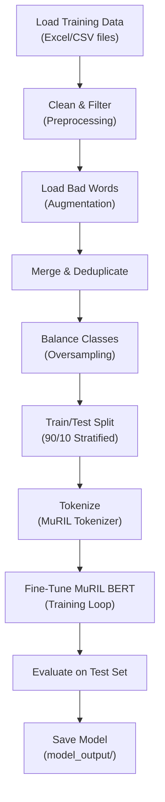

# Training Pipeline

## Overview

The training pipeline fine-tunes a pre-trained MuRIL BERT model on the Telugu-English hate speech dataset. The goal is to teach the model to distinguish between toxic and safe comments.

## Training Workflow



## Training Scripts

| Script | Environment | Purpose |
|---|---|---|
| `train_model.py` | Local PC | Train on your own machine (CPU or GPU) |
| `kaggle_training_v3.py` | Kaggle Notebook | Optimized for Kaggle's free GPU environment |

Both scripts follow the same pipeline. The Kaggle version includes additional optimizations for storage management and enhanced data augmentation.

## Hyperparameters

| Parameter | Value | Purpose |
|---|---|---|
| **Base Model** | `google/muril-base-cased` | Pre-trained Indian language model |
| **Max Sequence Length** | 128 tokens | Maximum input size per comment |
| **Epochs** | 10 (max) | Maximum training cycles through the dataset |
| **Learning Rate** | 2e-5 | Speed of weight updates |
| **Weight Decay** | 0.05 | L2 regularization to prevent overfitting |
| **Label Smoothing** | 0.1 | Softens labels (1.0 → 0.9, 0.0 → 0.1) to reduce overconfidence |
| **Warmup Ratio** | 0.1 | Gradually increases learning rate for the first 10% of training |
| **LR Scheduler** | Cosine | Smoothly decreases learning rate over time |
| **Batch Size** | 16 (GPU) / 8 (CPU) | Samples processed per step |
| **Eval Batch Size** | 32 (GPU) / 8 (CPU) | Samples per step during evaluation |
| **Early Stopping** | Patience = 3 | Stops training if no improvement for 3 epochs |
| **FP16** | Enabled (GPU only) | Uses half-precision floats for faster GPU training |

## Overfitting Prevention

The pipeline uses **five techniques** to prevent the model from memorizing the training data:

| Technique | How It Helps |
|---|---|
| **Early Stopping** | Stops training when the model stops improving on the test set |
| **Label Smoothing** | Prevents the model from being 100% confident on any prediction |
| **Weight Decay** | Penalizes large weights, encouraging simpler models |
| **Dropout (0.2)** | Randomly disables 20% of neurons during training |
| **Cosine LR Scheduler** | Gradually reduces learning rate, avoiding sharp local minima |

## How to Train

### On Kaggle (Recommended — Free GPU)

1. Upload your dataset to Kaggle as a dataset
2. Create a new Kaggle Notebook
3. Upload `kaggle_training_v3.py`
4. Run the script — it auto-detects the data directory
5. Download the `model_output_v3/` folder when done
6. Place the downloaded files into `backend/model_output/`

### On Local Machine

```bash
cd backend
pip install -r requirements.txt
python train_model.py
```

The trained model will be saved to `backend/model_output/` automatically.

## Output Files

After training, the `model_output/` directory contains:

| File | Purpose |
|---|---|
| `model.safetensors` | Trained model weights |
| `config.json` | Model architecture configuration |
| `tokenizer.json` | Tokenizer vocabulary and settings |
| `tokenizer_config.json` | Tokenizer metadata |
| `eval_results.json` | Final evaluation metrics |
| `training_args.bin` | Training configuration used |
